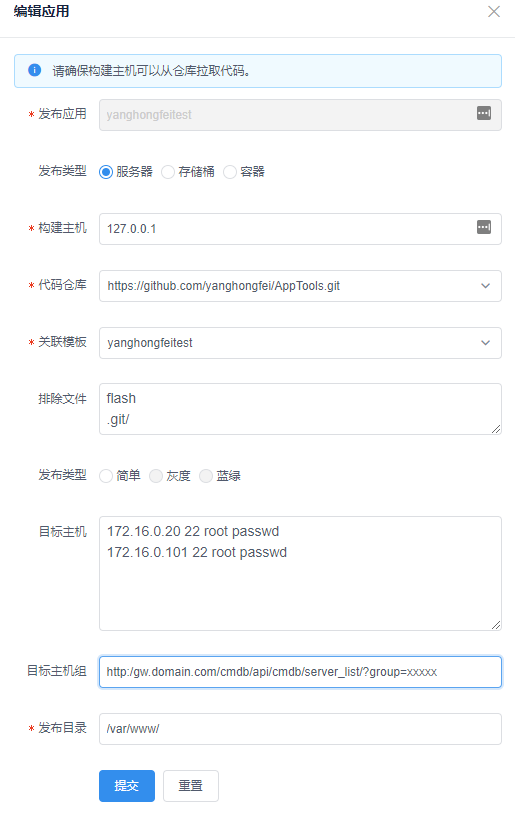
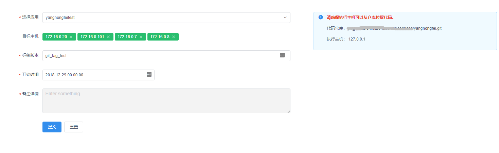

# Publish
> 只有后端代码逻辑，所有的配置信息都是从前端传过来的。

## Server发布
- `get_publish_info.py`: 获取发布信息写文件
- `pull_code.py`: 构建主机拉取代码
- `bulid_code.py`: 编译代码，如：`npm install`
- `upload_code.py`: 处理exclude过滤后将代码并发到目标主机的`/tmp`目录
- `backup_code.py`: 备份目标主机的代码到：`/tmp/code_backup`，只保留最近一个版本
- `depoly_code.py`: 部署/下发代码到目标主机的代码目录，并发操作
- `custom_operation.py`: 自定义操作，比如下发完代码后需要重启xxx进程， `systemctl restart nginx`

### 效果图
- 发布应用配置信息

- 提交发布

